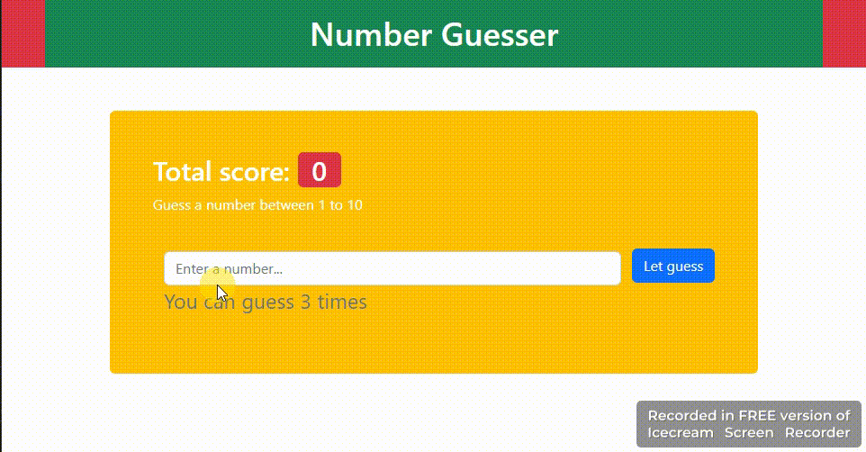

	<h1>Number Guessing Game</h1>
	
This is a simple number guessing game built with HTML, CSS, and JavaScript. The user has to guess a random number between a specified minimum and maximum value. The game provides feedback after each guess and ends when the user has run out of guesses or has guessed the correct number.

	<h2>How to Use</h2>
	
Open index.html in your web browser to start the game.

	<ol>
		<li>Enter a number in the input field and click the "Guess" button.</li>
		<li>If the number is correct, the game ends and you win. Otherwise, you will receive feedback on whether your guess was too high or too low.</li>
		<li>You have three chances to guess the correct number. If you run out of guesses, the game ends and you lose.</li>
		<li>To play again, click the "Play Again" button.</li>
	</ol>

	<h2>Files Included</h2>
	<ul>
		<li>index.html: The HTML file for the game.</li>
		<li>Bootstrap</li>
		<li>script.js: The JavaScript file for the game logic.</li>
	</ul>

	<h2>Features</h2>
	<ul>
		<li>Generates a random number between a specified minimum and maximum value.</li>
		<li>Provides feedback on whether the user's guess was too high or too low.</li>
		<li>Ends the game when the user has guessed the correct number or has run out of guesses.</li>
		<li>Allows the user to play again after the game has ended.</li>
		<li>Displays the user's score based on the number of games won.</li>
	</ul>
	<h2>Future Improvements</h2>
	
Some potential improvements for this game include:

	<ul>
		<li>Adding more levels with increasing difficulty.</li>
		<li>Allowing the user to set their own minimum and maximum values.</li>
		<li>Adding sound effects and animations for a more engaging user experience.</li>
		<li>Storing high scores and displaying them on a leaderboard.</li>
		<li>Making the game responsive for different screen sizes.</li>
	</ul>

